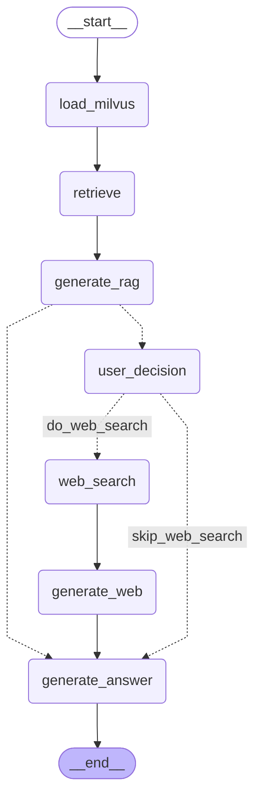

```mermaid
---
config:
  flowchart:
    curve: linear
---
graph TD;
	__start__([<p>__start__</p>]):::first
	load_milvus(load_milvus)
	retrieve(retrieve)
	generate_rag(generate_rag)
	user_decision(user_decision)
	web_search(web_search)
	generate_web(generate_web)
	generate_answer(generate_answer)
	__end__([<p>__end__</p>]):::last
	__start__ --> load_milvus;
	generate_rag -.-> generate_answer;
	generate_rag -.-> user_decision;
	generate_web --> generate_answer;
	load_milvus --> retrieve;
	retrieve --> generate_rag;
	user_decision -. &nbsp;skip_web_search&nbsp; .-> generate_answer;
	user_decision -. &nbsp;do_web_search&nbsp; .-> web_search;
	web_search --> generate_web;
	generate_answer --> __end__;
	classDef default fill:#f2f0ff,line-height:1.2
	classDef first fill-opacity:0
	classDef last fill:#bfb6fc

```